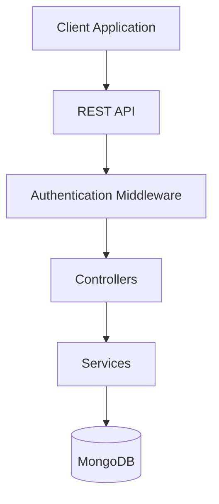

<div align="center">

# 🚀 Version Control System - Backend


### Secure & Scalable Backend for Version Control Management

RESTful API providing authentication, repository management, commit tracking, branch handling, and user operations.

</div>


## 📖 Overview

The **Version Control System Backend** is a robust server-side application designed to manage repositories, commits, branches, and user authentication. It provides secure REST APIs that enable developers to track project changes, collaborate efficiently, and maintain version history.


## ✨ Features

### 👤 User Management
- User Registration
- User Login
- JWT Authentication
- Profile Management
- Role-Based Access

### 📂 Repository Management
- Create Repository
- Update Repository
- Delete Repository
- View Repository History

### 🌿 Branch Management
- Create Branch
- Switch Branch
- Merge Branches
- Delete Branch

### 📝 Commit Management
- Create Commit
- View Commit History
- Track Changes
- Rollback Support

### 🔒 Security
- Password Hashing
- JWT Authentication
- Protected Routes
- Environment Variables


## 🏗️ System Architecture




## 🛠️ Tech Stack

| Technology | Purpose |
|------------|----------|
| Node.js | Runtime Environment |
| Express.js | Backend Framework |
| MongoDB | Database |
| Mongoose | ODM |
| JWT | Authentication |
| bcrypt | Password Security |
| dotenv | Environment Variables |


## 📁 Project Structure

```bash
backend/
│
├── src/
│   ├── controllers/
│   ├── routes/
│   ├── models/
│   ├── middleware/
│   ├── services/
│   └── utils/
│
├── config/
├── .env
├── package.json
└── server.js
```


## ⚙️ Installation

### Clone Repository

```bash
git clone <repository-url>
cd version-control-system-backend
```

### Install Dependencies

```bash
npm install
```

### Configure Environment

Create a `.env` file:

```env
PORT=5000
MONGO_URI=your_mongodb_uri
JWT_SECRET=your_secret_key
```

### Start Development Server

```bash
npm run dev
```

### Start Production Server

```bash
npm start
```


## 🔗 API Endpoints

### Authentication

| Method | Endpoint | Description |
|----------|----------|----------|
| POST | /api/auth/register | Register User |
| POST | /api/auth/login | Login User |

### Repository

| Method | Endpoint |
|----------|----------|
| GET | /api/repositories |
| POST | /api/repositories |
| PUT | /api/repositories/:id |
| DELETE | /api/repositories/:id |

### Commits

| Method | Endpoint |
|----------|----------|
| POST | /api/commits |
| GET | /api/commits |
| GET | /api/commits/:id |

### Branches

| Method | Endpoint |
|----------|----------|
| POST | /api/branches |
| GET | /api/branches |
| DELETE | /api/branches/:id |


## 🚀 Future Enhancements

- Pull Requests
- Merge Conflict Resolution
- CI/CD Integration
- Activity Logs
- Repository Analytics
- Team Collaboration

## 🤝 Contributing

Contributions are welcome!

1. Fork Repository
2. Create Feature Branch
3. Commit Changes
4. Push Branch
5. Open Pull Request

## 📜 License

This project is licensed under the MIT License.


<div align="center">

### ⭐ Star this repository if you found it helpful!

Made with ❤️ by **Umangi Patel**

</div>
